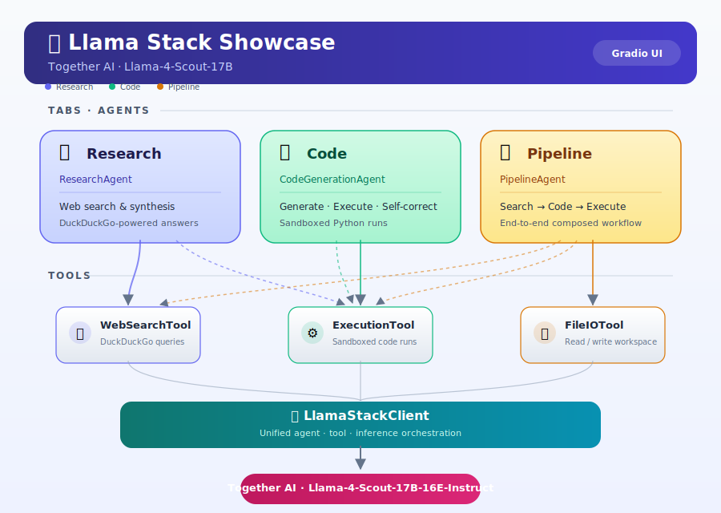

# Llama Stack Showcase



An end-to-end demonstration of Meta's `llama-stack` deployment and agent framework, wired to Llama 4 Scout (via Together AI or OpenRouter) and driving three real, tool-using agents behind a streaming Gradio UI.

## Overview

Meta's [llama-stack](https://github.com/meta-llama/llama-stack) is the official unified deployment and agent stack for the Llama 4 family. This project is a complete, working showcase: it wires a Llama 4 Scout endpoint to three tools (web search, sandboxed Python execution, local file I/O) and runs multi-step agentic workflows from start to finish. Everything is exposed through a Gradio UI with live, per-step log streaming — so you can see each tool call, each model reasoning step, and the final result as it is produced.

## Features

- **Three working agents**
  - *Research Agent* — runs web searches via DuckDuckGo and synthesizes a structured report.
  - *Code Generation Agent* — writes Python code for a natural-language task, executes it in a sandbox, and self-corrects up to three times on failure.
  - *Full Pipeline Agent* — combines research and code execution to answer data-analysis questions end-to-end with code-backed evidence.
- **Three real tools**
  - `WebSearchTool` (DuckDuckGo, no key required).
  - `CodeExecutionTool` (subprocess-isolated Python with a 10-second timeout and a dangerous-pattern denylist).
  - `FileIOTool` (read/write constrained to a local `workspace/` folder).
- **Streaming Gradio UI** with one tab per demo, a live log panel, and a formatted output panel.
- **Provider-agnostic client** — defaults to OpenRouter, falls back to Together AI, with an optional local-model path (e.g. Ollama) via `LLAMA_LOCAL=1`.
- **Fully tested** — 93 pytest cases covering tools, agents, client, UI construction, and history management.

## Architecture

```
 ┌──────────────────────────────────────────────┐
 │                 Gradio UI                     │
 │   (src/ui.py — 3 tabs, streaming log panes)   │
 └───────────────┬───────────────┬──────────────┘
                 │               │
        ┌────────┴──────┐  ┌─────┴─────────┐
        │  Agents       │  │  Client       │
        │  demos/       │  │  src/client.py│
        │  - research   │  │  OpenAI-compat│
        │  - code       │  │  OpenRouter / │
        │  - pipeline   │  │  Together AI  │
        └────┬──────────┘  └───────┬───────┘
             │                     │
        ┌────┴─────────────────────┴────┐
        │             Tools              │
        │   src/tools/                   │
        │   - search.py  (DuckDuckGo)    │
        │   - execute.py (sandboxed py)  │
        │   - file_io.py (workspace/)    │
        └────────────────────────────────┘
```

Each agent exposes a generator-based `run()` method that yields `{"type": "log", ...}` events for every tool call and reasoning step, then a final `{"type": "result", ...}` event. This makes it trivial to stream progress into any UI.

## Installation

Requirements: Python 3.10+.

```bash
git clone https://github.com/dakshjain-1616/llama-stack-showcase.git
cd llama-stack-showcase

python3 -m venv venv
source venv/bin/activate
pip install -r requirements.txt

cp .env.example .env
# edit .env with your API key (see API key setup below)
```

## API Key Setup

The client is provider-agnostic and picks a backend based on which environment variables are set:

| Provider    | Env var              | Default model                                      |
|-------------|----------------------|----------------------------------------------------|
| OpenRouter  | `OPENROUTER_API_KEY` | `meta-llama/llama-4-scout`                         |
| Together AI | `TOGETHER_API_KEY`   | `meta-llama/Llama-4-Scout-17B-16E-Instruct`        |
| Local       | `LLAMA_LOCAL=1`      | `llama3.2` on `http://localhost:11434/v1` (Ollama) |

Optional overrides: `LLAMA_BASE_URL`, `LLAMA_MODEL`.

To get a Together AI key, sign up at https://api.together.xyz and generate one at https://api.together.xyz/settings/api-keys.

## Usage

### Launch the Gradio UI

```bash
python app.py
```

Then open http://localhost:7860. Each of the three tabs has an input box, a Run button, a live log stream, and a formatted result panel.

### Demo 1 — Research Agent

Runs web searches and synthesizes findings into a markdown report.

```python
from demos.research_agent import create_research_agent
from src.tools.search import create_search_tool
from src.client import create_client

agent = create_research_agent(
    client=create_client(),
    search_tool=create_search_tool(),
)
for event in agent.run("What is llama-stack?"):
    print(event)
```

### Demo 2 — Code Generation and Execution Agent

Generates Python code for a task, runs it in the sandbox, and self-corrects up to three times on failure.

```python
from demos.code_agent import create_code_agent
from src.tools.execute import create_execution_tool
from src.client import create_client

agent = create_code_agent(
    client=create_client(),
    execution_tool=create_execution_tool(),
)
for event in agent.run("Compute the 20th Fibonacci number"):
    print(event)
```

### Demo 3 — Full Pipeline Agent

Takes a data-analysis question, searches for context, writes code, executes it, and produces a final answer with the code and output as evidence.

```python
from demos.pipeline_agent import create_pipeline_agent
from src.client import create_client
from src.tools.search import create_search_tool
from src.tools.execute import create_execution_tool

agent = create_pipeline_agent(
    client=create_client(),
    search_tool=create_search_tool(),
    execution_tool=create_execution_tool(),
)
for event in agent.run("What is the average of the first 100 primes?"):
    print(event)
```

### Running the test suite

```bash
pytest -v
```

All 93 tests run without an API key — the agents fall back to mock reasoning paths when no client is supplied.

## Project Structure

```
llama-stack-showcase/
├── app.py                   # HuggingFace Spaces entry point — launches the Gradio UI
├── requirements.txt
├── .env.example
├── assets/
│   └── infographic.svg
├── src/
│   ├── client.py            # Provider-agnostic OpenAI-compatible client
│   ├── ui.py                # Gradio Blocks UI with 3 tabs and live streaming
│   ├── history.py           # In-memory run history with export
│   └── tools/
│       ├── search.py        # DuckDuckGo web search tool
│       ├── execute.py       # Sandboxed Python execution tool
│       └── file_io.py       # Workspace-scoped read/write/list/delete tool
├── demos/
│   ├── research_agent.py    # Demo 1
│   ├── code_agent.py        # Demo 2
│   └── pipeline_agent.py    # Demo 3
├── tests/                   # 93 pytest cases
├── docs/
│   ├── ARCHITECTURE.md
│   ├── API.md
│   ├── demo_video_script.md
│   └── huggingface-spaces.md
└── workspace/               # Sandbox for file I/O and agent output
```

## Llama Stack vs. Raw API Calls

Raw API calls are fine for a single prompt-in / text-out exchange. Once you need tools, multi-turn reasoning, structured outputs, or deployment parity across providers, you end up rebuilding a large fraction of what Llama Stack already provides — tool registries, agent loops, streaming, and a uniform client surface. This project uses Llama Stack's client layer so you can swap Together AI, OpenRouter, and a local Ollama endpoint by changing a single environment variable.

## License

MIT. See `LICENSE`.
